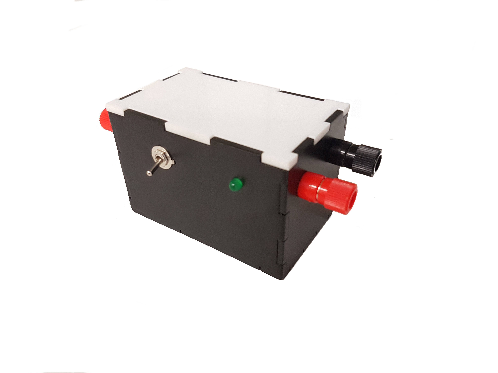

# DC-DC Step-up converter
---
## DC-DC Step-up converter

| Specifications                    |             |
|-----------------------------------|-------------|
| Input Voltage                     | 9VDC        |
| Output Voltage                    | 15-24VDC    |
| Input Current ( absolute maximum) | 3A          |
| Current without load              | 170mA       |
| Dimensions                        | 91x53x60 mm |

 
 
  
 
